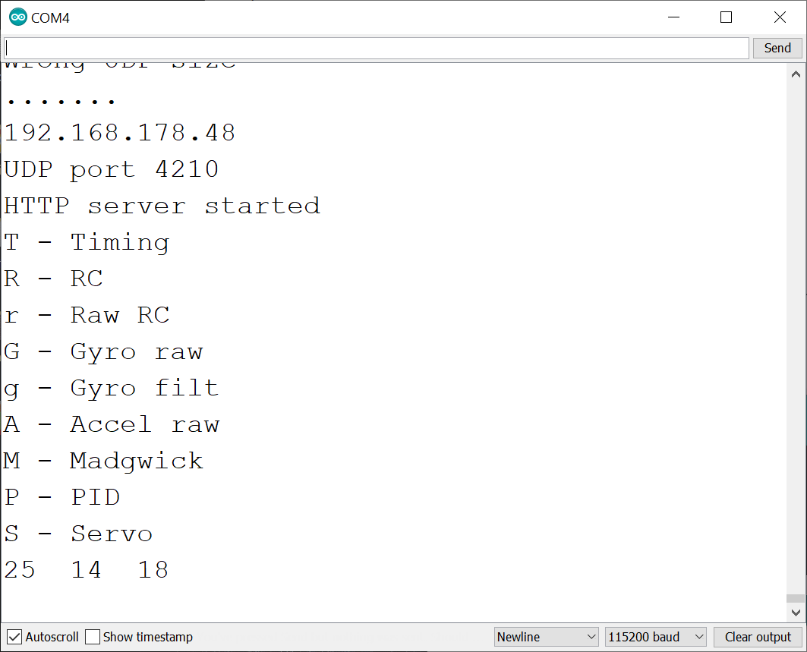
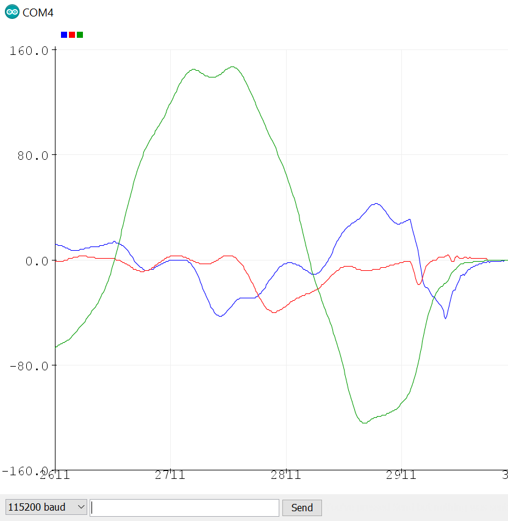
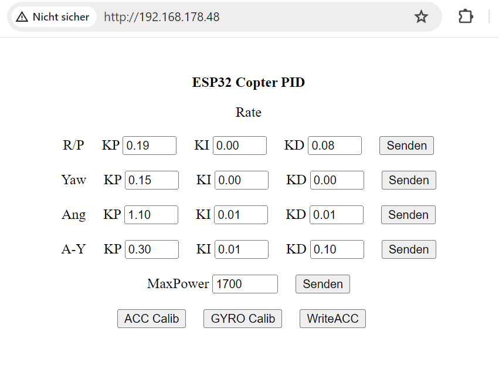

Schematic & description see:
https://github.com/PepeTheFroggie/EspCopter32/tree/master

Uses webpage PID setting.

Base for esp32-camcopter with built in wifi FPV. Unfinished.

For UDP transmitter see https://github.com/PepeTheFroggie/ESP32CAM_RCTANK/tree/master/ESP32webCAM_UDP/espnow_UDP_TX

Serial output options:

Serial Gyro Plot:

Webbased PID settings:

