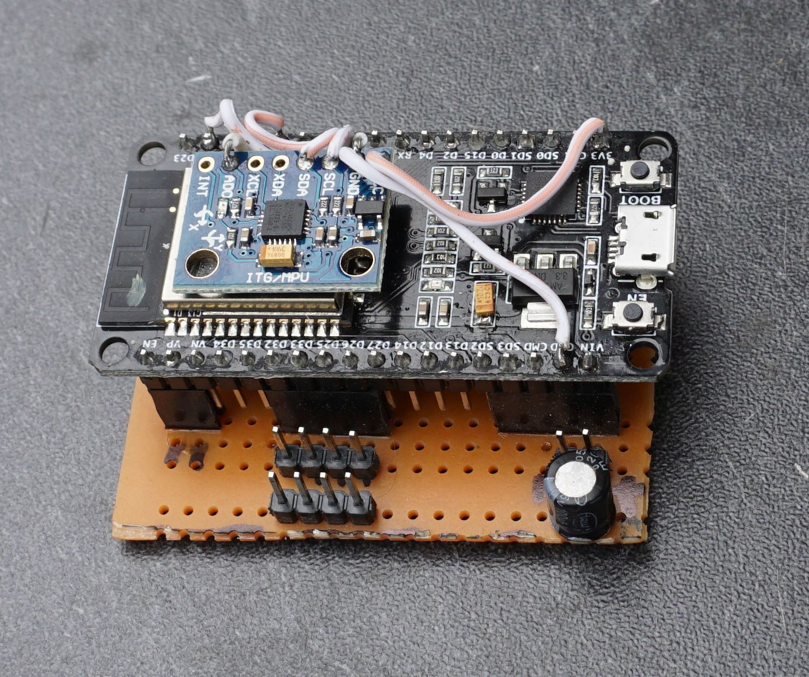
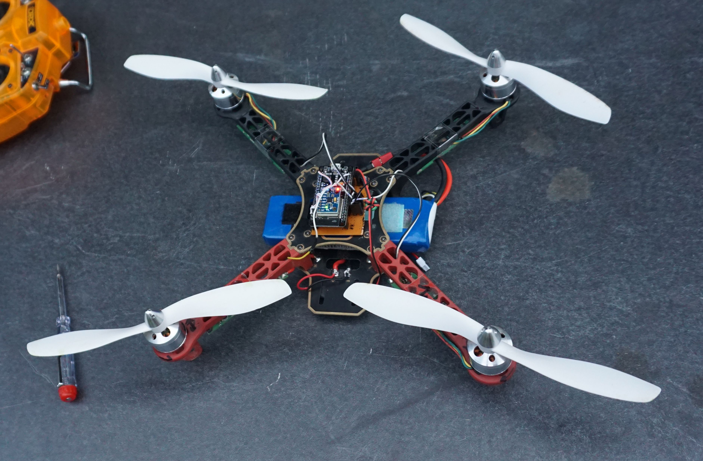

# Esp32Copter

Project using the ESP32 and MPU6050 to control a quadcopter. Done with arduino for esp32 ide. 
RC uses the ack-less ESPNOW protocol. See [espnow_RC_TX](https://github.com/PepeTheFroggie/espnow_RC_TX) for transmitter.

PWM output to esc's wiring:

* mot1 to D32, pin 32, BackRight
* mot2 to D33, pin 33, FrontRight
* mot3 to D25, pin 25, BackLeft
* mot4 to D26, pin 26, FrontLeft 

Refresh rate is about 6ms, pulses from 1ms to 2ms.

RC pulse input sequence is adaptable: 

* define ROL 1
* define PIT 2
* define THR 0
* define RUD 3
* define AU1 4
* define AU2 5

The copter will only arm after 1 second zero throttle. The copter will shut down motors RC data fails for more than 100ms.
The PID for level (acc) and gyro can be adjusted individually.  
To calibrate the ACC enter 'A' in the serial console.

6050 wiring: 

* SCL to D22, pin 39 
* SDA to D21, pin 42 
* VCC to Vin 
* GND to GND.
 
Optional external RC input:

* PPM SUM signal to pin 27
* uncomment "#define externRC"

Be sure you do acc_calib and write default params to eeprom before taking off. 
Acc_calib is done ba placing the copter on a level surface and press A on the serial console.
Default PID are written by press P on the serial console. Read them with R.

Deaultf PID are for a small copter, a bigger copter might need substantially lower values. Adjust gyro PID first and only if it flyes like silk adjust level_pid.
Experimental:
You can use a phone to change PID using external RC input. Define #ALLOWWEBSERVER. Connect to the IP given on serial console at startup. Use http, not https.

I hate modules with pinheaders installed. Makes em heavy, bulky, ugly.

Ugly, but it flies:

[Testflight](https://youtu.be/QWrKGh4auAo)  

