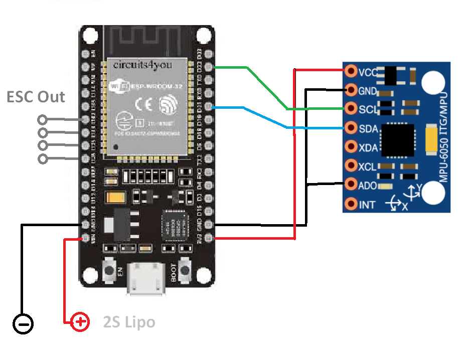

# EspCopter

Project using the ESP32 and MPU6050 to control a quadcopter. Done with arduino for esp32 ide. 
RC uses the ack-less ESPNOW protocol. See "espnow_RC_TX" for transmitter.

PWM output to esc's wiring:

* mot1 to D32, pin 32
* mot1 to D33, pin 33
* mot1 to D25, pin 25
* mot1 to D26, pin 26 

Refresh rate is about 6ms, pulses from 1ms to 2ms.

RC pulse input sequence is adaptable: 

* define ROL 1
* define PIT 2
* define THR 0
* define RUD 3
* define AU1 4
* define AU2 5

The copter will only arm after 1 second zero throttle. The copter will shut down motors RC data fails for more than 100ms.

The PID for level (acc) and gyro can be adjusted individually.  

To calibrate the ACC enter 'A' in the serial console.

6050 wiring: 

* SCL to D22, pin 39 
* SDA to D21, pin 42 
* VCC to Vin 
* GND to GND.
 

Old esp8266 version:
[Testflight](https://youtu.be/OhVVPzNwx6M)   
[Telemetry](https://youtu.be/0AWHVxgIqno)   

